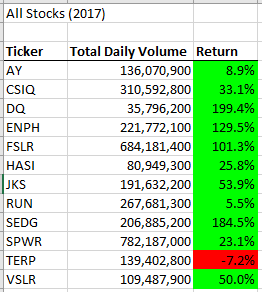
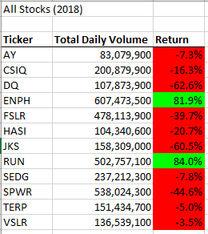
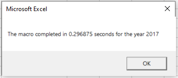
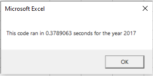

# Stock Analysis

## Overview of Project
### Purpose
The purpose of this analysis is to calculate the performance of a handful of green energy stocks.  Our client would like to use the information provided to determine if they should change their green energy investment strategy.

## Analysis Results

For reference, the Excel worksheet and macros used for the analyses described below can be found [here](./VBA_Challenge.xlsm).

### Stock Performance 2017 and 2018

The total daily volume and yearly return for each of the stocks analyzed is shown in the figures below.  In general, 2017 seems to have been a strong year for all of the analyzed stocks.  But, in 2018, most of those same stocks took heavy losses.  ENPH and RUN had strong gains both years.  VSLR, TERP, SEDG, and AY all had only small losses in 2018.  

Based solely on the data available, it may make sense to move away from DQ and diversify across ENPH, RUN, VSLR, TERP, SEDG, and AY.

<figure>

<figcaption><b>Figure 1 - 2017 Green Energy Stock Performance</b></figcaption>
</figure>

<figure>

<figcaption><b>Figure 2 - 2018 Green Energy Stock Performance</b></figcaption>
</figure>

### Macro Performance

While working on the module exercises I did not follow the coding exactly as described in the module.  I have prior experience writing software and, from the start, I knew I wanted to design the code differently than what was provided.  Therefore, my performance comparisons may be different than expected.  

Figure 3 below shows the performance of the code that I wrote while working through module 2.  My original code only has only one loop, which iterates over the data worksheet that is selected by the user.  When it encounters a new stock ticker, it calculates all of the results from the prior ticker and puts them directly into the results sheet.  It does not use an array for any intermediate storage.  Also, rather than using a hard-coded list of stock tickers the macro discovers each one as it goes.  See macro AllStocksAnalysis in the workbook referenced earlier for the code.   

<figure>

<figcaption><b>Figure 3 - Original Code Performance</b></figcaption>
</figure>

For the refactored code I followed the challenge instructions closely, using a hard-coded stock ticker array and the other arrays for intermediate storage.  Performance of the new code is shown below.  I ran both my original and the refactored code several times to ensure that the performance results are consistent.  See macro AllStocksAnalysisRefactored in the workbook referenced earlier for the code.   

<figure>

<figcaption><b>Figure 4 - Refactored Code Performance</b></figcaption>
</figure>

## Summary

- What are the advantages or disadvantages of refactoring code? 
    - The advantages of refactoring code are numerous, including the following:
        - Faster processing
        - Lower memory consumption
        - Improved code readability
        - Fewer lines of code
        - Improved security
        - Learning!

    Given a good set of existing tests that make it easy to validate changes, I have not encountered any disadvantages to refactoring, other than it can take a bit of time.  However, if no test exists then a possible disadvantage is injection of new defects into the code.

    Even for a veteran programmer, the very first block of code written is usually not the final code they use.  Every refactoring iteration improves understanding and contributes to learning, which typically results in much better code.

- How do these pros and cons apply to refactoring the original VBA script?
    
    For the specific pair of examples provided in this summmary, the original code is actually faster and more memory efficient than the refactored code.  However, if the original code were identical to what was done as part of module 2, then the refactored code would be faster.  In both cases, writing the code two different ways and comparing their performance contributed substantially to learning the fundamentals of VBA for Excel.

